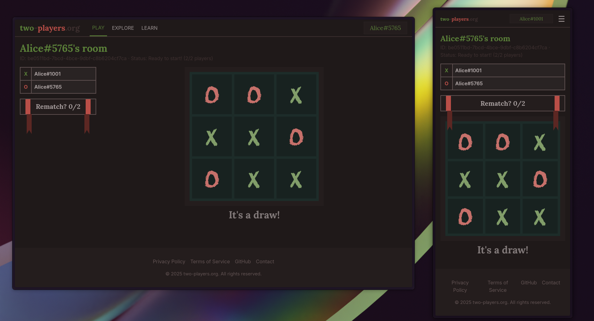

# two-players.org



## Project Description

two-players.org is a web platform designed to facilitate real-time multiplayer games directly from your browser. Currently, the platform supports the classic Tic-Tac-Toe game, allowing users to create game rooms and compete against each other.

### Features

- **Real-time Games**: Experience fluid and reactive gameplay thanks to real-time communication.
- **Intuitive Interface**: A clean and easy-to-use user interface for an enjoyable gaming experience.

### Technologies Used

**Backend (Go)**:
- **Go**: Main programming language.
- **PostgreSQL**: Database for storing room and connection information.
- **WebSockets**: For real-time communication between the server and clients.
- **sqlc**: Go code generation from SQL.
- **go-migrate**: For database migrations.

**Frontend (SvelteKit)**:
- **SvelteKit**: Framework for building the user interface.
- **TypeScript**: For more robust and statically typed frontend development.
- **Tailwind CSS**: For fast and responsive design.
- **Socket.IO Client**: For managing WebSocket connections on the client side.

### Local Setup and Execution

To set up and run the project locally, follow these steps:

#### 1. Prerequisites

Make sure you have the following installed:
- **Go**: Version 1.22 or higher.
- **Node.js**: Version 18 or higher (includes npm).
- **Bun**: For frontend package management.
- **PostgreSQL**: An accessible PostgreSQL instance.

#### 2. Database Configuration

Create a PostgreSQL database and ensure the connection URL is configured in the backend's `.env` file. You can copy the `.env.example` file to `.env` and modify it.

```bash
cp backend/.env.example backend/.env
# Edit backend/.env with your DATABASE_URL
```

Run database migrations to create the necessary tables:

```bash
cd backend
go install github.com/golang-migrate/migrate/v4/cmd/migrate@latest
migrate -path db/migrate -database "YOUR_DATABASE_URL" up
cd ..
```

#### 3. Backend Execution

Navigate to the `backend` directory and run the server:

```bash
cd backend
go run cmd/server/main.go
```

The backend server will run by default on `http://localhost:8080`.

#### 4. Frontend Execution

Navigate to the `frontend` directory, install dependencies, and run the application:

```bash
cd frontend
bun install
bun run dev
```

The frontend application will run by default on `http://localhost:5173`.

Now you can open your browser and visit `http://localhost:5173` to interact with the application.
